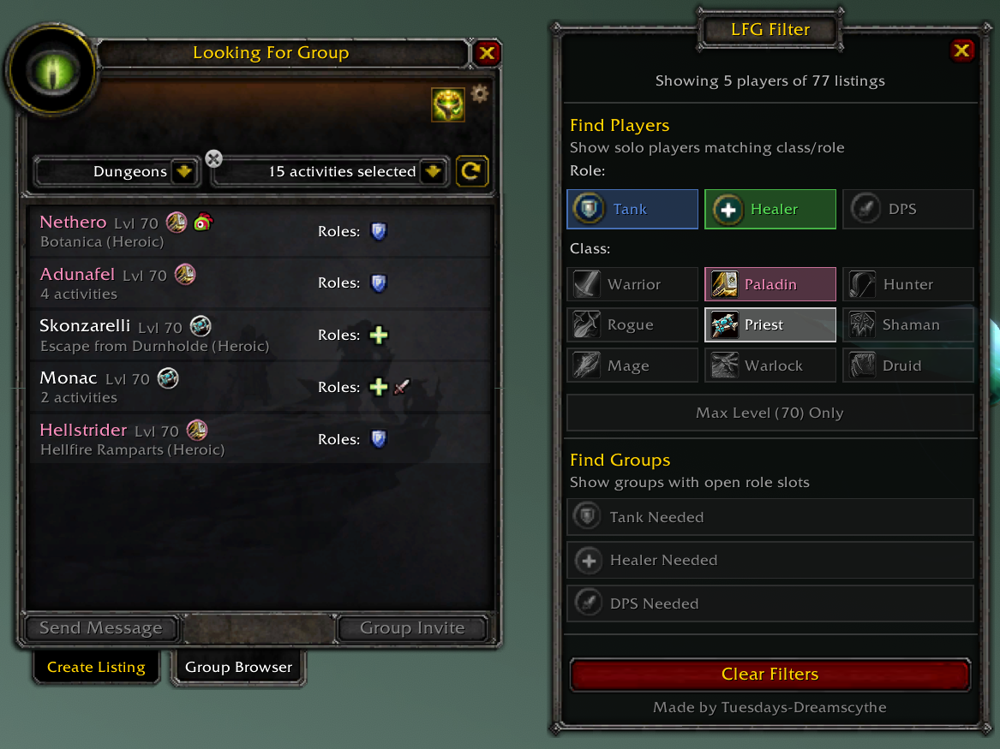

# LFG Filter

Adds class and role filtering to the TBC Anniversary Looking For Group browser.

## Features

- **Find Players** - Filter solo players by class and/or role (for group leaders building a group)
- **Find Groups** - Filter groups by open role slots: Tank, Healer, or DPS needed (for solo players looking for a group)
- Filters apply instantly on toggle
- Filter preferences saved between sessions
- Side panel anchored to the LFG window

## Installation

### WoWUp
Add the GitHub repo URL in WoWUp: `https://github.com/0xTuesdays/LFGFilter`

### Manual
1. Download `LFGFilter-x.x.x.zip` from [Releases](https://github.com/0xTuesdays/LFGFilter/releases)
2. Extract the `LFGFilter` folder into `World of Warcraft/_anniversary_/Interface/AddOns/`
3. Restart the game or `/reload`

## Slash Commands

| Command | Description |
|---------|-------------|
| `/lfgf` | Show available commands |
| `/lfgf show` | Show filter panel |
| `/lfgf hide` | Hide filter panel |
| `/lfgf reset` | Clear all filters |
| `/lfgf debug` | Print debug info |
